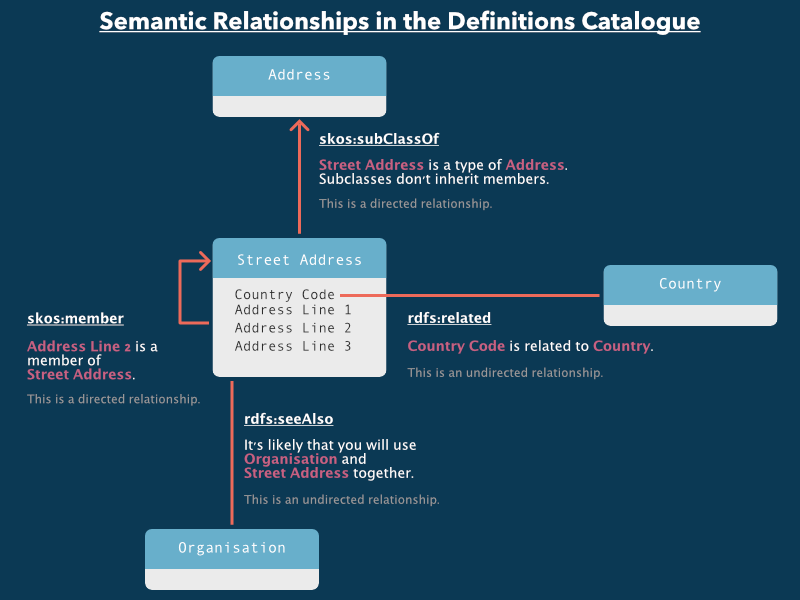

{:.collection}

{:.page_head}
# Reusing the definitions of others

{:.sub_head}
Our [Definitions Catalogue](https://definitions.ausdx.io) makes is easy to discover what data is collected and used by government no matter who defines it, how it is defined, or where it is defined.

{:.sub_head}
This guide will help you find definitions that you can reuse in your own community.



## Finding definitions
{:.coming_soon}

## Synonyms
{:.coming_soon}

## Relationships between definitions

The Definitions Catalogue allows definition authors to describe the relationships between definitions. These relationships help to more semantically describe the definitions, and to create more structured data models.

We store relationships as [RDF triples](https://www.w3.org/TR/rdf-concepts/#section-data-model), giving definition authors lots of semantic flexibility.

### Showing the relationships

The catalogue will generate UML class diagrams if definitions have the following relations:

Here is an [example generated image](https://definitions.ausdx.io/definition/ce/ce1).

## Browsing by community
{:.coming_soon}

## Using the API

We've built an API you can use to integrate the definitions catalogue into your own tools and processes.

Using our [Service Catalogue](https://services.ausdx.io/service/definitions-catalogue), you can read the documentation, try out live examples and generate code for the definitions catalogue API and many other government APIs.
